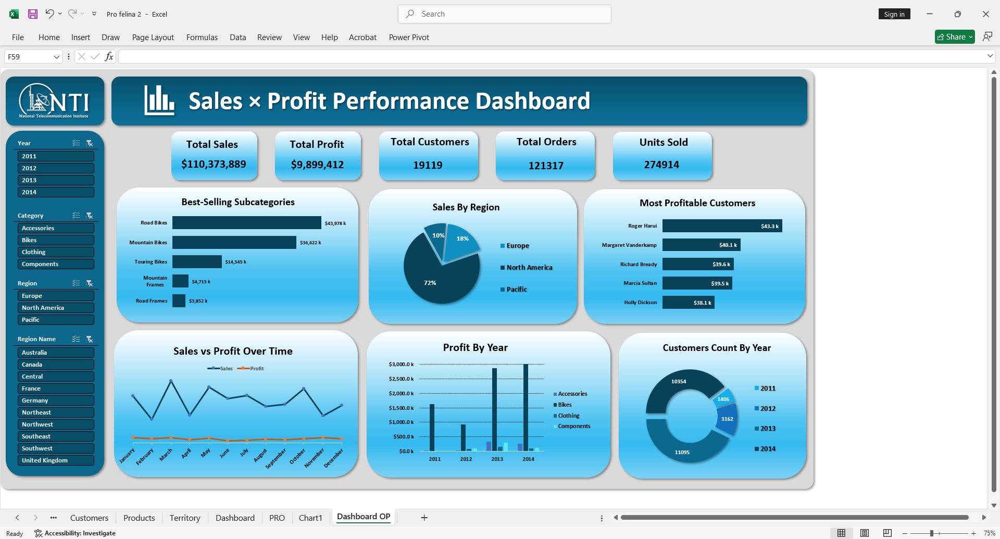

# Sales × Profit Analysis

This Excel project analyzes company sales and profitability.  
It provides insights into total sales, total profit, orders, top products, customers, and regional trends.

---

## Dashboard Highlights
- Total sales, profit, and orders overview, including best-selling products.  
- Most profitable customers and sales breakdown by region.  
- Sales vs. profit trends over time and profit by year.  
- Customer count trends by year.

---

## Files in Repository
- `Sales & Profit Performance.xlsx` → Excel workbook with full analysis.  
- `salesxprofit.png` → Dashboard screenshot.

---

## How to Use
1. Download the `.xlsx` file.  
2. Open it in **Microsoft Excel**.  
3. Explore the charts, tables, and pivot analyses interactively.

---

## Skills Demonstrated
- Data cleaning and preparation  
- Pivot tables and charts  
- Trend analysis and KPI calculation  
- Sales and profitability insights  

---

## Dashboard Screenshot

---

Created as part of a professional **data analysis portfolio** showcasing Excel analytical skills.
